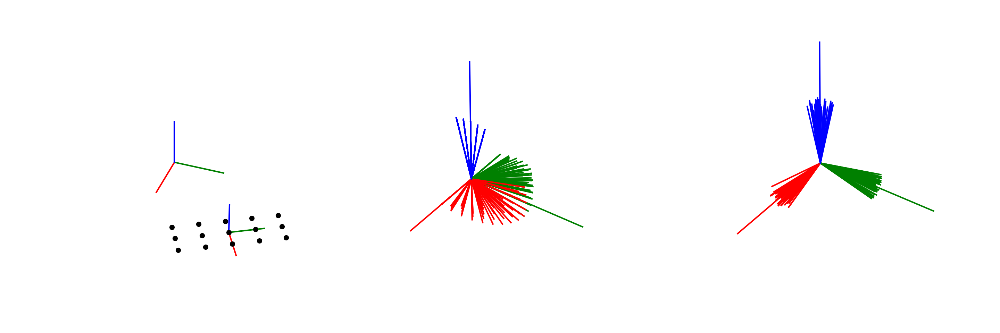

# sampling_based_tube_following_2
Instructions to recreate plots from my current research.

## Creating figures from recorded data

Running the scripts `figure_<1>_case_<i>.py` will generate the figures in the `figures` folder. The python packages [acrolib](https://pypi.org/project/acrolib/) and [acrobotics](https://pypi.org/project/acrobotics/) are available with `pip install`.

**Note** that `acrobotics` is not supported on Windows or MacOS, I'm sorry :s The package depends on [python-fcl](https://pypi.org/project/python-fcl/), which has no Windows or MacOS support. On Ubuntu 18.04, everything should work.

**Also**, you have to install cython (`pip install cython`) before installing acrolib, as mentioned in the readme.

## Running the simulations

To run the simulations, instead of generating the figures based on recorded data, please read the instructions in the folders `case 1` and `case 2`.
